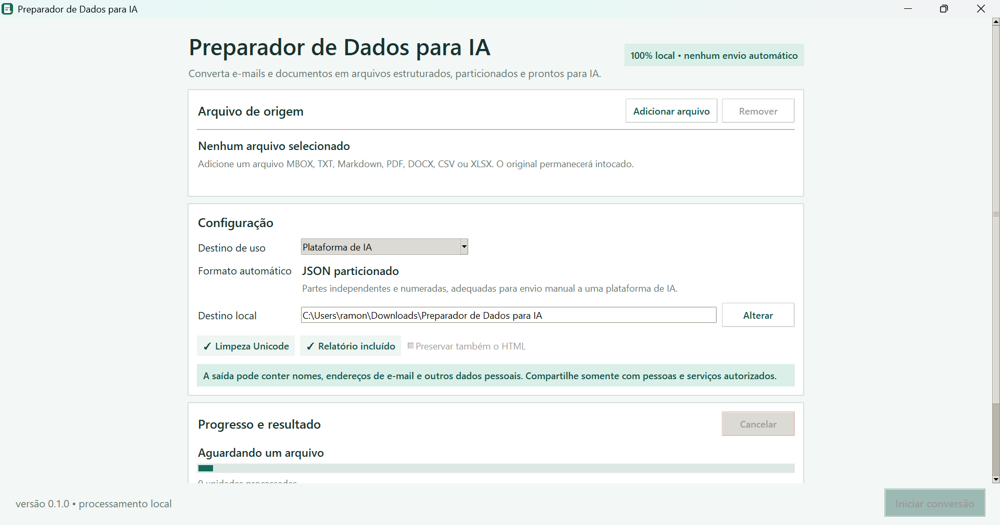

# Preparador de Dados para IA

Plataformas de inteligência artificial nem sempre aceitam arquivos como MBOX ou
documentos muito grandes diretamente. O Preparador de Dados para IA é uma
aplicação local para extrair, limpar, estruturar e particionar esses conteúdos em
formatos mais adequados para análise por IA.

O programa oferece interface gráfica e linha de comando, preserva o arquivo
original e organiza cada conversão em uma pasta própria, com arquivos prontos
para uso e relatório técnico separado.

**Versão 0.1.0 concluída e validada no Windows.**

[Baixar a versão portátil para Windows](https://github.com/ramonvluz/preparador-de-dados-para-ia/releases/download/v0.1.0/Preparador-de-Dados-para-IA-portatil-0.1.0-windows-x64.zip)



## Principais funcionalidades

- Conversão local por interface gráfica ou CLI.
- Escolha automática do formato de saída conforme a origem e o destino de uso.
- Particionamento por tamanho e estimativa de tokens.
- Saídas compactas em `PRONTO_PARA_IA`, sem repetição desnecessária de metadados.
- Relatório auditável com informações técnicas, avisos e limitações.
- Limpeza Unicode conservadora, sem correções semânticas automáticas.
- Progresso, cancelamento seguro e preservação das partes já concluídas.
- Perfis para envio manual a plataformas de IA ou integração via API.

## Formatos suportados

| Formato de origem | Tratamento principal | Saída recomendada |
|---|---|---|
| MBOX | Conversão incremental de mensagens e catálogo de anexos | JSON ou JSONL particionado |
| TXT | Leitura com detecção de codificação e limpeza conservadora | Markdown particionado |
| Markdown | Preservação da estrutura textual | Markdown particionado |
| PDF | Extração de texto com referências de página e catálogo de imagens | Markdown particionado |
| DOCX | Preservação de títulos, parágrafos, listas e tabelas simples | Markdown particionado |
| CSV | Detecção de delimitador, cabeçalho, codificação e tipos | JSON ou JSONL particionado |
| XLSX | Preservação de abas, tabelas, intervalos, tipos e fórmulas | JSON ou JSONL particionado |

## Segurança e processamento local

- O processamento ocorre no computador do usuário, sem envio automático à internet.
- O arquivo de origem permanece no local original e não é alterado.
- Caminhos absolutos da origem não são gravados nos artefatos nem no relatório.
- Anexos de e-mail são catalogados, mas seus binários não entram nas saídas.
- Erros de mensagens individuais não registram o conteúdo da mensagem.
- A saída pode preservar dados pessoais já existentes no arquivo original.

## Usar a versão portátil

Baixe o [ZIP portátil da versão 0.1.0](https://github.com/ramonvluz/preparador-de-dados-para-ia/releases/download/v0.1.0/Preparador-de-Dados-para-IA-portatil-0.1.0-windows-x64.zip),
descompacte todo o conteúdo e execute `Preparador de Dados para IA.exe`.

O pacote não depende de Python ou VS Code. Como o executável ainda não possui
assinatura digital comercial, o Smart App Control de alguns computadores com
Windows 11 pode bloquear sua execução. Nesses ambientes, use o código-fonte ou
uma compilação assinada; não é recomendado desativar proteções do Windows apenas
para executar o programa.

Consulte o [manual rápido](docs/MANUAL_RAPIDO.md) para conhecer o fluxo da
interface e a organização dos resultados.

## Executar a partir do código-fonte

Requisitos: Windows e Python 3.11 ou mais recente.

```powershell
git clone https://github.com/ramonvluz/preparador-de-dados-para-ia.git
cd preparador-de-dados-para-ia
py -m venv .venv
.\.venv\Scripts\Activate.ps1
python -m pip install --upgrade pip
python -m pip install -e .
python -m preparador_dados_ia.ui
```

Para instalar também as ferramentas de testes e empacotamento:

```powershell
python -m pip install -e ".[dev]"
```

## Uso da linha de comando

```powershell
preparador-dados "C:\caminho\arquivo.mbox"
preparador-dados "C:\caminho\relatorio.pdf"
preparador-dados "C:\caminho\dados.csv" --profile api
preparador-dados "C:\caminho\planejamento.xlsx" --output "C:\saida"
```

Use `preparador-dados --help` para consultar todas as opções. Por padrão, os
resultados são criados em `Downloads\Preparador de Dados para IA`.

## Gerar a versão portátil

Com as dependências de desenvolvimento instaladas:

```powershell
.\scripts\build_portable.ps1
```

O build utiliza PyInstaller em modo `onedir` e grava em `dist/` a pasta
executável, o ZIP portátil e o arquivo `SHA256SUMS.txt`.

## Validação

- 105 testes automatizados aprovados.
- Análise estática, formatação e compilação dos módulos verificadas.
- MBOX real de aproximadamente 2,66 GiB e 3.699 mensagens convertido sem falhas.
- CSV real de 113.036 linhas e XLSX real validados sem perda de registros.
- Pacote portátil testado em outro computador Windows sem Python.

Para executar a validação local:

```powershell
.\scripts\validate.ps1
```

As fixtures incluídas no repositório são artificiais e usam domínios reservados.

## Limitações conhecidas

- A interface processa uma fonte por conversão.
- PDFs digitalizados não possuem OCR nesta versão.
- O conteúdo de anexos de e-mail não é extraído.
- Arquivos `.xls` antigos não são suportados; utilize `.xlsx`.
- Fórmulas de planilhas são preservadas, mas não executadas.
- Detecção e anonimização de dados pessoais não fazem parte desta versão.

## Documentação técnica

- [Arquitetura](docs/ARQUITETURA.md)
- [Documento de requisitos](docs/PRD.md)
- [Status do projeto](docs/STATUS_PROJETO.md)
- [Manual rápido](docs/MANUAL_RAPIDO.md)
- [Validação de equivalência](docs/VALIDACAO_EQUIVALENCIA.md)
- [Validação da interface desktop](docs/VALIDACAO_FASE_2.md)
- [Contratos e arquitetura](docs/VALIDACAO_FASE_3A.md)
- [Conversão de TXT e Markdown](docs/VALIDACAO_FASE_3B.md)
- [Conversão de PDF](docs/VALIDACAO_FASE_3C.md)
- [Conversão de DOCX](docs/VALIDACAO_FASE_3D.md)
- [Contratos tabulares](docs/VALIDACAO_FASE_4A.md)
- [Conversão de CSV](docs/VALIDACAO_FASE_4B.md)
- [Conversão de XLSX](docs/VALIDACAO_FASE_4C.md)

## Licença

Distribuído sob a [Licença MIT](LICENSE).
